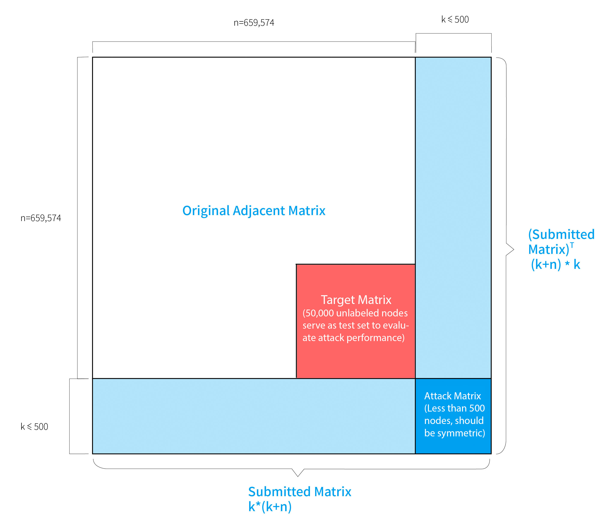

# KDD_CUP_2020_MLTrack2_SPEIT
KDD CUP 2020 ML Track 2 "Adversarial Attacks and Defense on Academic Graph": 1st Place Solution

Team: **SPEIT-卓工**
Members: Qinkai Zheng, Yixiao Fei, Yanhao Li, Qingmin Liu, Minhao Hu, Qibo Sun
Most of members are from Shanghai Jiao Tong University, SPEIT institute. Qibo Sun is with Université Paris Saclay, Paris, France. 

## Introduction

- 

In this competition, we consider the paper citation networks, which is a very big graph with 659,574 nodes and 5,757,154 edges. The edges represent the citation relations between papers. Each node has a 100-dimension features (extracted from the abstract of paper) and belongs to one of 18 classes. All participants are required to submit one attacker and one defender. The attacker is a modified version of the given graph. The defender is a model that classify the graph robustly. All attackers and defenders from all teams are matched to calculate the average performance. 

More details can be found in the following sites:
KDD CUP 2020 official site: https://www.kdd.org/kdd2020/kdd-cup
ML Track2 "Adversarial Attacks and Defense on Academic Graph" site: https://www.biendata.xyz/competition/kddcup_2020_formal/

## Data

* **Adjacent Matrix**
  * **adj_matrix_formal_stage.pkl**
  * **md5:** 0a19ee0738e5bec33baca066a6988200
  * 659574*659574. Each non-zero entry indicates a link between two nodes (i.e the citation relationship between two research papers).

* **Node Features**
  * **feature_formal_stage.npy**
  * **md5:** b43a04c531d69d9a48df73610798107a
  * 659574*100. 100-dimention feature for each node.

* **Labels for Training Nodes**
  * **train_labels_formal_stage.npy**
  * **md5:** dc16bd1b44738264ca07084e7a9a4938
  * Labels of first 609,574 nodes.

Data can be downloaded through [Baidu]( https://pan.baidu.com/s/15TuQ0iRcIwixLt6a-aUWJg) (code: acjt) or [Dropbox](https://www.dropbox.com/s/z5outoz1r2bnp8j/kdd_cup_phase_two.zip?dl=0).

## Attack

* **Objective:** Decrease classification accuracy on 50,000 unlabeled test nodes.

* **Requirements:** 
  * Black-box scenario, no knowledge of target models, no modification on original data.
  * Attack matrix: ≤500 nodes. Each attack node: ≤100 edges.
  * Features’ range: [-2, 2].
* **Solution:**
  * **Adversarial Adjacent Matrix Generation**.
  * **Enhanced Feature Gradient Attack**.
  * Implementation details and explaination can be found in ```main/attack.ipynb```.

## Defense

* **Objective:** Maintain accuracy on the test nodes.

* **Requirements:**
  * Inference time <10s (on a K80 GPU).
*  **Solution:**
  * **Feature Denoising** 
  * **Feature Transformation**
  * **Topology Adaptive GCN** [1]
  * Implementation details and explaination can be found in ```main/defense.ipynb```.

## Requirements

* dgl==0.4.3.post2
* scipy==1.4.1
* tqdm==4.46.0
* torch==1.5.0
* numpy==1.18.1

## Reference

[1] Du, J., Zhang, S., Wu, G., Moura, J. M., & Kar, S. (2017). Topology adaptive graph convolutional networks. arXiv preprint arXiv:1710.10370.